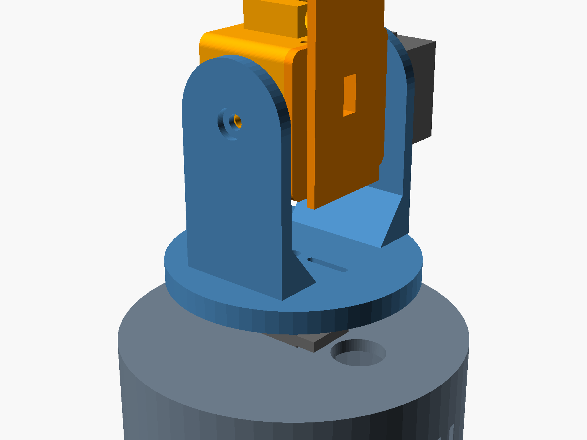

# Still There?

*Sentry goin' up.* A face-tracking pan/tilt turret on the Seeed Studio XIAO ESP32S3 Sense.

Camera pan/tilt turret built around the Seeed Studio XIAO ESP32S3 Sense (OV2640, 8 MB PSRAM).
Two MG90S metal-gear servos, on-device face detection (esp-dl) or motion detection, a proportional
tracking loop with scan-when-lost, a laser/LED "fire" output, and a web UI with live MJPEG.
Enclosure is parametric OpenSCAD (2021.01), five printed parts, no supports.

```
firmware/    PlatformIO project (Arduino core 2.0.17, espressif32 6.13.0)
hardware/    turret.scad, render scripts, stl/ output
```



## Bill of materials

Purchase links for everything below except the board and servos: [BOM.md](BOM.md).

| Qty | Item | Notes |
|----:|------|-------|
| 1 | Seeed Studio XIAO ESP32S3 Sense | with the camera expansion board fitted |
| 2 | MG90S 9 g metal-gear servo (SupSeek 4-pack or TowerPro) | 2.0 kg-cm @ 6 V, 20T spline, ships with single/double/cross horns |
| 1 | 6 mm laser diode module (optional) | 5 V, fits the saddle on the head |
| 1 | 470 uF+ electrolytic across servo 5 V/GND | servo current spikes reset the board otherwise |
| 1 | 5 V 2 A supply | USB-C into the base inlet or a panel-mount breakout |
| 6 | M2 x 8 self-tapping screws | 4 base lid, 2 head lid |
| 2 | M2 x 8 self-tapping screws | head wall into the single-arm horn (from inside the head) |
| 2 | M2 x 6 self-tapping screws | disc into the double-arm horn (from the top of the disc) |
| 4 | servo ear screws | supplied with the servos: 2 pan servo to base plate, 2 tilt servo to arm A |
| 2 | servo center horn screws | supplied with the servos |
| 1 | M3 x 12 screw | tilt pivot (arm B into the head) |
| 4 | 10 mm rubber feet | recesses in the base lid |

## Wiring

XIAO pin labels on the left, GPIO in brackets. Camera pins (GPIO 10-18, 38-40, 47, 48) and the
LED/SD-CS (GPIO 21) are used by the Sense board; D0-D3 are free.

| XIAO | GPIO | Function |
|------|-----:|----------|
| D0 | 1 | pan servo signal |
| D1 | 2 | tilt servo signal |
| D2 | 3 | laser / LED (through a 100 R resistor or a transistor if > 20 mA) |
| D3 | 4 | trigger button to GND (optional, toggles laser) |
| 5V | | servo + laser power (USB 5 V passthrough) |
| GND | | common ground |

Power the servos from the 5 V pin only if the supply into USB-C can source 2 A. For anything
more than bench testing, feed 5 V into the base and run a wire pair up to the head (the head lid has
a 5 mm grommet hole; solder to the 5V/GND pads on the XIAO). The XIAO's own USB-C then stays free
for flashing.

## Firmware

Face tracking depends on the esp-dl models that ship with arduino-esp32 **2.0.x**
(`libhuman_face_detect.a`, `libdl.a`). PlatformIO `espressif32 @ 6.13.0` pins that core. The Arduino
IDE with esp32 core 3.x compiles the same sources, but `HAVE_ESP_DL` resolves to 0 there and the Face
mode is disabled in the UI (motion, scan and manual still work).

### Build and flash (PlatformIO)

```
cd firmware
copy include\secrets.h.example include\secrets.h     # edit SSID / password
pio run -t upload
pio device monitor
```

Without `secrets.h` (or with an empty SSID) the turret starts an access point `turret` / `turret123`
at `http://192.168.4.1/`. On a LAN it is reachable at `http://turret.local/`.

Verified builds: PlatformIO env `xiao_esp32s3_sense` (1.53 MB flash, face detection linked), and
`arduino-cli compile --fqbn esp32:esp32:XIAO_ESP32S3:PSRAM=opi` on core 3.3.7 via
`firmware/make_arduino_sketch.ps1` (motion/manual only).

### Runtime

| Task | Core | Job |
|------|-----:|-----|
| `detect` | 1 | grab 240x240 RGB565, person (face acquire + torso color track) or motion (30x30 cell luma diff), feed tracker, draw overlay, JPEG, publish |
| `control` | 1 | 50 Hz: slew servos toward setpoints (rate + smoothing limits), scan sweep, laser |
| httpd :80 | 0 | `/` UI, `/status` JSON, `/control?var=&val=`, `/aim?x=&y=`, `/capture` |
| httpd :81 | 0 | `/stream` MJPEG of the latest published frame |

Tracking law: per detection, `setpoint += kp * (error / half-frame)` outside a pixel deadband;
the control task then moves at most `maxStep` degrees per tick. Motion detection is suppressed for
`settle` ms after any servo motion so the turret does not chase its own panning. After `lost` ms
without a target the pan sweeps between limits (`scan when lost`). When the aim point has stayed
inside the deadband for `lock ms`, the state is LOCK; with Auto-fire on, the laser follows LOCK.
LOCK has hysteresis: correction keeps running while locked, and the lock only releases when the error
exceeds `deadband x lock release` (default 3x) or the target is lost, so a slowly moving target is
followed with the laser held on.

Person mode: the esp-dl face detector (MSR01 + MNP01) only *acquires* the target. As soon as a face
is found, a CAMShift-style color tracker is seeded from the torso region below it (hue/saturation
ratio histogram against the whole frame) and follows the torso frame to frame at camera rate. The
face detector then re-runs every `face re-detect ms` (default 1 s) to re-anchor the track and refresh
the color model; between re-detections the person can turn, look away or walk sideways and the track
holds, because the torso tracker needs neither a frontal face nor a static background. When the color
match drops below `torso min confidence` for `lost` ms the track is dropped and the next face starts a
new one. "Torso color tracking" can be switched off to fall back to face-only tracking.

Aim point: the tracker centers a point `aim below` face-widths under the face center (default 2.3,
the chest; 0 = the face itself). While the torso tracker carries the target the same point is held at
a fixed proportion of the torso window, so it rides along with the person. Face width in pixels scales with 1/distance exactly like any body
offset does, so this is distance-independent: about 2.3 face-widths lands a laser boresighted
parallel to the camera on the chest at any range. The overlay draws the aim point tethered to the
face. The laser saddle sits ~20 mm above the lens, a fixed parallax that is negligible beyond a metre.

All tuning values are live in the web UI and persist to NVS with "Save settings".

Web UI keys: arrows nudge, Space centers, L toggles the laser, 1-4 select mode; click the image to
aim at that point.

Status LED (GPIO 21): fast blink while connecting, slow blink in AP mode, short blink while a
target is fresh, solid on LOCK.

### Servo pulse range

`SERVO_MIN_US`/`SERVO_MAX_US` are 544/2400 us (Arduino Servo defaults), which gives roughly 180 deg on
MG90S units. The TowerPro sheet quotes 1 to 2 ms for +-90; many clones need the wider range for
full travel. Check that neither servo buzzes at 0 or 180 before widening.

### Direction and trims

Servo orientation decides sign. In Face or Motion mode, if the turret runs away from the target
toggle "Invert pan" or "Invert tilt". Pan/tilt trim offsets the mechanical center. Both persist.

## Enclosure

`hardware/turret.scad` is a single parametric file. Select a part with `-D part="..."`.

| Part | Print orientation | Notes |
|------|-------------------|-------|
| `base` | top plate on the bed | pan servo drops through the plate, flange screws down into two bosses; 12 mm cable hole, rim notch for a panel-mount USB-C/DC breakout (slides in from below, the lid closes it), vent slots |
| `base_lid` | flat | 4x M2 into wall bosses, rubber-foot recesses, vent grid |
| `yoke` | disc on the bed | pan horn pocket underneath with 4 radial M2 slots; arm A carries the tilt servo (body outside, flange on the outer face), arm B has the M3 pivot with a countersink |
| `head` | front face on the bed | 1.6 mm coax groove in the pivot-side wall (U.FL to back opening); 24 mm deep so the 21 mm horn pocket fits inside the side face; XIAO + Sense clamped between four front pads and four lid posts; camera window, horn pocket on +Y, M3 pivot boss on -Y, USB-C slot in the floor, 6 mm laser saddle on top, vent slots |
| `head_lid` | antenna plate on the bed | 3 mm friction lip, 2x M2 from the top wall, 5 mm wire grommet, USB notch, 22 x 42 mm plate for the WiFi patch antenna with a 4 x 8 coax slot at its center |

Render everything:

```
cd hardware
powershell -ExecutionPolicy Bypass -File render.ps1      # or: bash render.sh
```

Output goes to `hardware/stl/` (five STLs plus `assembly.png`, `plate.png`). Then run
`python make_project.py --slice` to rebuild the Flash Studio project from the new STLs.
`-D part="assembly"` shows the whole turret with mock servos and board; `-D part="plate"` lays the
five parts out flat.

### Flash Studio project (Creator 5 Pro)

`hardware/turret_creator5pro.3mf` is a ready Flash Studio (Orca-Flashforge 2.4.2) project: all five
parts placed flat on the 256 x 256 plate, printer preset `Flashforge Creator 5 Pro 0.4 nozzle`,
unmodified stock process `0.20mm Standard @FF C5` (0.2 mm, 3 walls, 15 % grid infill, auto brim,
no support), filament `Flashforge PETG Basic @FF C5P`, bed type High Temp Plate (85 C). Open it with File > Open Project, or drag it onto the plate. Swap the filament preset to a
PLA one if you print PLA; the layout and process carry over. `turret_creator5pro_plate.png` shows the
first-layer footprint of each part on the bed. Sliced with these presets: about 3 h 10 min, 73 g of
PETG, no supports, no slicer warnings. Regenerate after CAD changes with `python make_project.py --slice`.

It was produced with the slicer's CLI (`flash studio.exe --load-settings ... --export-3mf`) after
flattening the preset inheritance chains; the CLI refuses system profiles that still carry
`inherits` and no `type` field.

Material: PETG is the better choice for this design. The 3 mm yoke arms, the 2.3 mm wall behind
the horn pocket and the M2 self-tapping pilots all load thin plastic; PETG's layer adhesion and
lower brittleness beat PLA there, and it does not creep under the constant preload of the friction
lip and screws inside a warm enclosure. PLA prints with tighter tolerances and better bridges, so
if you print PLA expect the friction lip to be snugger and drop `lip_clr` to 0.2 only if it turns
out loose. Either way the stock 0.20 mm Flashforge profile is the right starting point: its 3
perimeters fill every thin section of these parts solid, so infill settings barely matter, and no
supports are needed. Clearances (`clr`, `lip_clr`, `m2_*`/`m3_*` pilots) are at the top of `turret.scad`.

### Assembly

1. Center both servos electrically first (flash the firmware, power up, wait for both to hit 90).
2. Base: drop the pan servo through the top plate, flange up, screws into the two bosses. Slide the
   power inlet board into the rim notch, route its cable and the servo leads through the 12 mm hole,
   then screw on the lid.
3. Yoke: seat the **double-arm** horn in the channel under the disc (arms along the camera axis) and
   drive two M2 screws down through the slots into arm holes. Fit the tilt servo through arm A from the outside; the flange lands on the
   outer face; two M2 screws through the flange into the arm. Push the yoke onto the pan spline
   with the arms square to the camera direction and drive the horn screw down through the disc
   countersink.
4. Head: lay the **single-arm** horn in the channel on the +Y face, arm pointing down (it may stick
   out ~3.5 mm past the bottom edge; trim it if you like) and drive two M2 screws from inside the head.
   Fit the board stack USB-C down: seat the camera module in the square socket first (lens through the
   window), let the XIAO settle onto the two USB-end pads, put a ~3 mm foam pad on the two far-end
   standoffs so it touches the camera board, then press the lid on (its posts stop 0.2 mm off the XIAO
   back) and drive the two M2 screws through the top wall.
5. Antenna (required: the XIAO ESP32S3 has no on-board antenna). Before the board goes in, seat the
   kit's U.FL plug (press one side in first, per Seeed), lead the coax out of the board stack on the
   pivot side into the wall groove, back through the 4 x 8 slot in the lid, and stick the 20 x 40
   patch to the plate on the outside of the lid over the slot. Coil the spare cable in the 6 mm space
   behind the XIAO. `coax_side` in `turret.scad` mirrors the groove if your U.FL is on the other side.
6. Optional laser: push the 6 mm module into the saddle, M2 set screw from the top.

### Dimensions that matter

All at the top of `turret.scad`, mm:

- `sv_*`: MG90S envelope from the TowerPro configuration table (A 32.5 ear span, B 22.8 body,
  C 28.4 bottom to spline top, D 12.4 width, F 18.5 bottom to ear top). The body through-cuts use a
  looser 23.6 x 12.8 envelope because clones measure up to 23.9 x 12.7; the ear screws (slotted
  pilots, 27.3 to 28.3 mm spacing) locate the servo.
- Servo and horn dimensions measured on the SupSeek MG90S kit (two units), 2026-09-11:

  | | measured | in CAD |
  |---|---|---|
  | body length x width | 22.8 x 12.4 | 23.6 x 12.8 cut + clearance |
  | ear span (H) | 32.2 | ears rest on the surface, no cut |
  | ear hole spacing | 27.8 / 28.0 | slotted pilots 27.3 to 28.5 |
  | ear top to boss top (K) | 7.3 / 7.5 | 7.4 |
  | hub diameter | 6.8 | 7.4 counterbore |
  | arm plate thickness (E) | 2.0 | 2.6 recess |
  | arm width (D) | 5.1 | 6.1 channel |
  | single arm, center to tip (C) | 18.0 | head channel, open to the bottom edge |
  | double arm, tip to tip (J) | 31.2 | disc channel |
  | single arm: boss top to arm face / hub top | 3.8 / 6.4 | head gap; 5.8 deep hub counterbore (horn wall 6.5) |
  | double arm: boss top to arm face / hub top | 5.85 / 6.26 | disc height; 3.6 deep counterbore (disc 5.0) |

  The kit's cross horn is asymmetric (~31 mm long axis) and does not fit the head, so the pan disc
  takes the **double arm** and the head the **single arm**, pointing down (it extends ~3.5 mm past
  the head's bottom edge; trim it flush if you like). Pockets are rounded channels with one
  continuous M2 screw slot per arm, so hole positions in the horn do not matter. The horn screw on
  the disc sits on top without a countersink. `gap_margin` (0.8) still biases toward the hub seating
  slightly short rather than the head rubbing the arm.
- Board stack (XIAO ESP32S3 **Plus** 17.76 x 21.25 with the camera board, measured 2026-09-13):
  lens front to XIAO back 13.44, lens front to XIAO top face 12.30, 3.0 mm board-to-board gap,
  camera board 18 x 15 (wider than the XIAO, flush with its far end), 8 x 8 module housing with a
  7 mm barrel, lens center 10.8 above the USB edge and on the board centerline. The camera module
  hangs on a short flex and is **not** fixed to the camera board: the head holds it in an 8.6 mm
  square socket behind a 7.4 mm window, so the flex pushes it into the socket. The XIAO is located
  by two pads on its exposed USB-end corners and four lid posts (0.2 mm clearance, no squeeze); two
  standoffs at the camera board's far-end corners stop 3 mm short so a foam pad steadies that end
  without loading the connector. `lens_protrude` (2.3, barrel past the housing face) is derived, not
  measured; the flex absorbs a couple of mm either way.
- `axis_h` 34: tilt axis above the disc. Raise it if you use a straight USB-C plug in the head.
- Tilt limits in firmware (`TILT_MIN_DEG`/`TILT_MAX_DEG`, 35..145) keep the head off the yoke;
  pan is 0..180.

## Known limits

- esp-dl face detection at 240x240 takes 100-200 ms; in Person mode it only runs on acquisition and
  every `face re-detect ms`, so the torso tracker and the stream run at 10-20 fps in between. The
  stream and detection share one frame pipeline, so the stream stutters on re-detect frames.
- The torso tracker is a color tracker: a person whose shirt matches the background, or two people in
  the same shirt, will confuse it. The ratio histogram suppresses background colors but not another
  identical shirt. The face re-detect re-anchors it every second, which limits how far it can wander.
- Motion mode re-references every frame; a target that stops moving disappears until `lost` expires.
- The USB-C slot in the head floor assumes a right-angle cable that runs backward; a straight plug
  hits the yoke disc when tilting down.

## Whole-body person detection: env `xiao_espdet` (default build)

Two firmware flavours live side by side. `xiao_esp32s3_sense` / `xiao_expansion` are the original
esp-dl 1.x face acquisition + torso color tracking on arduino-esp32 2.0.17. `xiao_espdet` (developed
on the `espdet-pico` branch, now merged) swaps the acquisition detector for Espressif's ESPDet-Pico pedestrian model
(esp-dl 3.3.11, `espressif/pedestrian_detect` 0.3.2, 224x224 input). A body box does not need a
frontal face, so masked, turned-away or side-on people are acquired, and the aim point is a fraction
down the box (`aim down body`, default 0.25) instead of "below the face".

Measured on the XIAO ESP32S3 Sense (2026-09-11): detector 190 to 210 ms per run including the
resize, scores 0.5 to 0.86 on a seated person with a mask, torso tracker 6 to 15 ms between runs,
overall 6 to 7 fps with re-detection every 300 ms, 110 KB heap / 6.7 MB PSRAM free, no resets.

How it is built (no ESP-IDF CMake, no component manager):

- Platform: pioarduino `stable` (Arduino 3.3.6 on the IDF 5.5 SDK), plain `framework = arduino`.
  This is the same platform your other pioarduino projects use. esp-dl 1.x face models do not exist
  on this core, so `HAVE_ESP_DL` is 0 and `HAVE_ESPDET` is 1.
- `firmware/lib/espdl`: esp-dl 3.3.11 subset for ESP32-S3 (dl core, xtensa + TIE-728 assembly
  kernels, fbs_loader, vision/detect, vision/image without JPEG/PPA/YUV/HSV) as a PlatformIO
  library; the prebuilt `libfbs_model.a` is linked by `link_fbs.py`. Kconfig options are supplied
  as `-D` flags in `platformio.ini`.
- `firmware/lib/pedestrian_detect`: the component's `.cpp/.hpp` plus the model, packed with esp-dl's
  `pack_espdl_models.py` and embedded 16-byte aligned through `model/pedestrian_detect_model.S`
  (`.incbin`), which provides the `_binary_pedestrian_detect_espdl_start` symbol the component expects.
- `person_detect.cpp` wraps `PedestrianDetect`; the torso color tracker, lock logic, web UI and
  servo control are unchanged. Person mode seeds the torso tracker from the upper 35 % of the body box.
- Camera task stack is left at the SDK default here; the frame-copy and log-sink fixes from `main`
  still apply.

Build / flash from **PowerShell or VS Code**, not Git Bash: pioarduino's tool installer refuses to
run under MSYS (`ERROR: MSys/Mingw is not supported`) and the compiler is then not found.

    pio run -e xiao_espdet -t upload --upload-port COM6

Flash use is 3.0 MB of the 3.3 MB app slot. If it grows, switch `board_build.partitions` to
`max_app_8MB.csv` (drops OTA).

Falling back to the face build is a reflash: `pio run -e xiao_expansion -t upload --upload-port COM6`.
NVS settings are shared (same keys). The turret powers up in the mode that was active when settings
were last saved (default Person).

## Bring-up notes (2026-09-10, board on the XIAO Expansion Board, no servos)

- Build/flash: `pio run -e xiao_expansion -t upload --upload-port COM6`. The expansion env moves the
  tilt servo to D2 and the laser to D6 because the expansion board owns D1 (user button) and D3
  (buzzer); it adds the SSD1306 status page (OLED found at 0x3C) and buzzer cues.
- Camera image was upside down in this mounting: set H-mirror and V-flip in the UI and Save. The
  head-mounted orientation will differ; set it once there.
- Crash found and fixed: panic "Stack canary watchpoint triggered (cam_task)". The camera driver's
  2 KB task logs `EV-VSYNC-OVF` through vprintf whenever a frame is held too long; the newlib lock
  setup inside that printf overflows the stack. Fixes: the detector now copies each frame to PSRAM
  and returns the driver buffer immediately, the driver gets 3 buffers, and the IDF log vprintf is
  replaced with a no-op (`esp_log_level_set` was not sufficient in this SDK build). A bare
  `cam_hal: EV-VSYNC-OVF` line can still show on the console now and then; it comes through the ROM
  printf and is harmless.
- Second crash found and fixed: heap corruption (`StoreProhibited`/`LoadProhibited` in the WiFi task
  a few seconds after the first face detection). `fb_gfx` has no bounds checking at all. Two overlay
  writes left the frame: the face-center marker at `y-2` with the face at the top edge (where
  `aim below` puts it), and the "face NNNms" text placed 14 px above the bottom while the fb_gfx
  font (FreeMonoBold 12pt) draws 24 rows downward. Every overlay primitive, text included, now goes
  through clipped helpers, and the PSRAM work frame has 8 KB guard bands on both sides.
- After the person leaves, the torso color tracker can keep matching background at its minimum
  window size; a track with no face confirmation for `faceTimeoutMs` (default 8 s) is now dropped.
- LEDC: ESP32-S3 allows at most 14-bit PWM resolution; the servo driver asked for 16 and silently
  failed. Now 14-bit (1.2 us per step at 50 Hz).
- The esp-dl face model does not detect masked faces. Acquisition needs an unmasked, roughly
  frontal face; a mask blocks Person mode acquisition entirely (torso tracking still works once
  acquired).
- Pipeline rates on the S3: 10 fps in Manual (deliberately capped), 15-16 fps in Person mode while
  no face is present (stage-1 detector 6-14 ms), stream to a PC over the AP at the same rate.
- Opening the USB serial port from a host tool resets the board (USB-Serial-JTAG DTR/RTS). Test
  over HTTP and open serial only when you want a fresh boot log.
